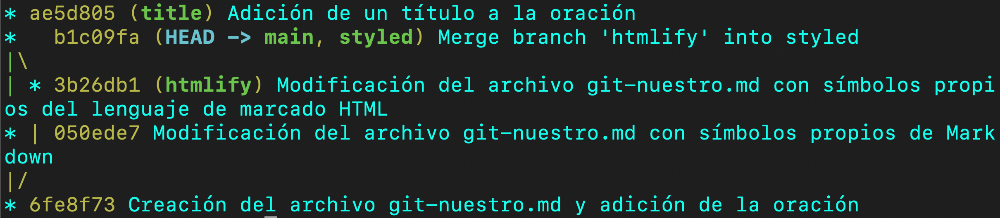

# Bootcamp Desarrollo de Apps Móviles

---

  <strong>Autor:</strong> Salva Moreno Sánchez

  

## Herramientas

  
  
  

## Práctica del módulo de git, GitHub y Sourcetree

1. **¿Qué comando utilizaste en el paso 11? ¿Por qué?**

	Se ha usado el comando `git reset --hard HEAD~1`, el cual permite mover la rama *styled* un *commit* hacia atrás y, además, deshechar los cambios realizados en el estado *Working Copy* al añadir el argumento `--hard`. Todo ello en un mismo paso.
	
	Cabría destacar que este proceso también se podría realizar en dos pasos:
	
	1. `git reset HEAD~1`: se mueve la rama *styled* al *commit* padre.
	2. `git restore git-nuestro.md`: carga la versión anterior del archivo.

2. **¿Qué comando o comandos utilizaste en el paso 12? ¿Por qué?**

	Se ha empleado el comando `git reflog` para conocer el identificador del *commit* del que me moví o me "deshice" previamente y, a continuación, se ha ejecutado el comando `git reset --hard <id del commit>` para que la rama *styled* se mueva y apunte hacia el *commit* identificado.

	
3. **El merge del paso 13, ¿Causó algún conflicto? ¿Por qué?**

	Se ha usado el comando `git merge main` y no ha causado conflictos, recibiendo por consola el mensaje *Already up to date*. En un primer momento, sería lógico esperar que aparecieran conflictos ya que hemos realizado cambios en líneas coincidentes en el archivo *git-nuestro.md*; sin embargo, la rama *main* está situada en el *commit* padre de la rama *styled*, por lo que se entiende que los cambios ya están fusionados en la rama y se pueden volver a ellos a través del movimiento entre *commits*. Además, cabe destacar que no se ha creado un *commit* nuevo fruto de la fusión.

4. **El merge del paso 19, ¿Causó algún conflicto? ¿Por qué?**

	Se ha usado el comando `git merge htmlify` y sí ha causado conflictos debido a cambios realizados en líneas coincidentes en el archivo *git-nuestro.md*. En este caso, no ocurre lo mismo que en la [pregunta anterior](#pregunta-3), ya que se debe llevar a cabo la fusión de la rama *styled* con la rama *htmlify* para poder acceder al histórico de *commits* compartidos por las mismas; creando, así, un nuevo *commit* fruto de la fusión y cuyos padres son los dos *commits* donde se situaban los punteros de dichas ramas.

	
5. **El merge del paso 21, ¿Causó algún conflicto? ¿Por qué?**

	Se ha usado el comando `git merge styled` y no ha causado conflictos ya que, a pesar de que hay cambios entre los archivos *git-nuestro.md* de los *commits* donde se sitúan los punteros de las ramas, se ha realizado un *merge fast-forward* al haber un camino lineal respecto al histórico de *commits* desde el *HEAD* de la rama *styled* hasta el *HEAD* de la rama *main*. De esta forma, la rama *main* pasa a apuntar al *commit* donde se sitúa el puntero de la rama *styled*.

6. **¿Qué comando o comandos utilizaste en el paso 25?**

	Se ha usado el comando `git log --graph --branches --oneline`, el cual permite ver el *log* de forma muy esquemática con las ramas representadas, además de sus conexiones, *commits* y sus respectivos mensajes, así como los identificadores acortados de cada uno de estos.
	
	

	Si queremos obtener información mucho más detallada, como el autor y la fecha de cada *commit*, así como su identificador completo, podemos ejecutar el comando `git log --graph`.
	
7. **El merge del paso 26, ¿Podría ser fast forward? ¿Por qué?**

	Sí. De hecho, si se hubiera ejecutado el comando `git merge title` en vez del que se ha empleado (`git merge --no-ff title`), *Git* hubiera hecho un *merge fast-forward* ya que lo hace automáticamente si, como ya hemos comentado en la [pregunta 5](#pregunta-5), hay un camino lineal respecto al histórico de *commits* desde el *HEAD* de la rama *title* hasta el *HEAD* de la rama *main*. En este caso, no se ha realizado el *merge fast-forward* porque se ha explicitado en el comando con el argumento `--no-ff`. Cabe señalar que también podemos configuar *Git* para que siempre haga *no fast-forward* y, así, no emplear el argumento expuesto.

8. **¿Qué comando o comandos utilizaste en el paso 27?**

	Se ha usado el comando `git reset HEAD~1`.

9. **¿Qué comando o comandos utilizaste en el paso 28?**

	Se ha usado el comando `git restore git-nuestro.md`.

10. **¿Qué comando o comandos utilizaste en el paso 29?**

	Se ha usado el comando `git branch -D title` ya que si se usa `git branch -d title` va a dar por consola *error: The branch 'title' is not fully merged*, lo cual significa una advertencia sobre que la rama que se está a punto de borrar contiene *commits* que van a ser inaccesibles desde otra cualquier rama. Por tanto, con el comando `git branch -D title` obligamos a *Git* a eliminar la rama a pesar de la inaccesibilidad comentada.

11. **¿Qué comando o comandos utilizaste en el paso 30?**

	Como queremos volver a un *commit* al que ya no apunta ninguna rama, debemos realizar los siguientes pasos para la resolución de esta cuestión:
	
	1. `git reflog`: para rastrear el camino que ha seguido el puntero *HEAD* y, de esta manera, conocer el identificador del *commit* que alberga el *merge* donde la rama *main* absorbió a la rama *title*. 

	2. `git reset --hard <id del commit>`: una vez que conocemos el identificador del *commit*, se ejecuta dicho comando para mover la rama *main* al *commit* que se deshizo para rehacerlo al completo.

	En este punto, si ejecutamos el comando `git log --graph --branches --oneline`, podemos observar que hemos vuelto al mismo estado que cuando realizamos el *merge no fast-forward* de *title* a *main*, con la excepción de que la rama *title* no la tenemos instaurada. Aún así, se resolvería fácilmente ejecutando un `git branch title <id del commit>`, siendo el identificador el del *commit* donde agregamos el título al archivo, identificador accesible desde el *log*.

12. **¿Qué comando o comandos usaste en el paso 32?**

	Para la resolución de esta problemática se han seguido los siguientes pasos:
	
	1. `git log --graph --branches --oneline`: observando el *log* resumido, se obtiene el identificador del primer *commit*, donde se creó el archivo *git-nuestro.md*.

	2. `git reset --hard <id del commit>`: una vez que se tiene el identificador, se ejecuta dicho comando para que la rama *main* se mueva al *commit* inicial, desechando aquello que se tenía previamente en el *Working Copy*.

13. **¿Qué comando o comandos usaste en el punto 33?**

	Para la resolución de esta cuestión se han seguido los siguientes pasos:
	
	1. `git reflog`: para rastrear el camino que ha seguido el puntero *HEAD* y, de esta manera, conocer el identificador del *commit* que alberga el *merge* donde la rama *main* absorbió a la rama *title*, el cual representa el estado final de nuestro histórico.

	2. `git reset --hard <id del commit>`: una vez que conocemos el identificador del *commit*, se ejecuta dicho comando para mover la rama *main* al *commit* que se deshizo para rehacerlo al completo.

---

[Subir ⬆️](#top)